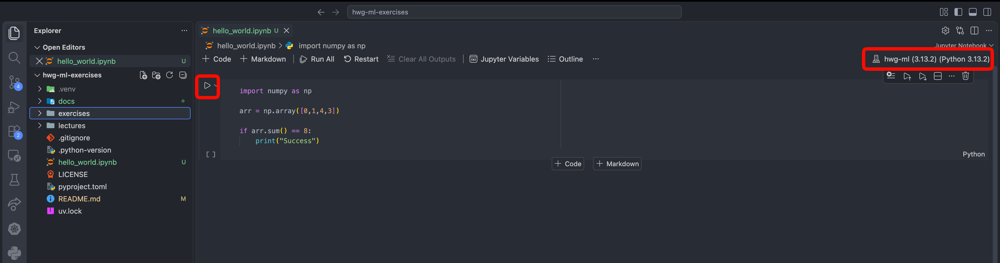

# C29331 Machine Learning


Welcome to the C29331 Machine Learning repository! This project is aimed to assist you in working on the exercises. 

## Prerequisites

You will need to work with your terminal to get these tools installed.

### Git

Make sure you have [Git](https://git-scm.com/) installed on your machine. You can download it from the official website and follow the installation instructions for your operating system using the [official guide](https://git-scm.com/book/en/v2/Getting-Started-Installing-Git).

### Visual Studio Code

This guided repo assumes that you are working with [Visual Studio Code](https://code.visualstudio.com/). If you haven't installed it yet, please download and install it from the official website. It will also work with other IDEs, but I can only provide support for VS Code.

### UV

We will be using [UV](https://docs.astral.sh/uv/) to manage our Python environment. Please download and install it on your device using the official [installation guide](https://docs.astral.sh/uv/getting-started/installation/).


## Cloning the Repository

Clone the repository to your local machine using the following command:

```bash
git clone https://github.com/ItsZiroy/hwg-ml.git
```
Navigate into the cloned directory:

```bash
cd hwg-ml
```

## Setting Up the Environment
You can use either UV (recommended for this course) or Anaconda/Conda. Pick the workflow you prefer — both will let you open and run the notebooks in `exercises/`.

### Using UV (recommended)
Create a new Python environment and install the pinned dependencies from `pyproject.toml` and `uv.lock` with:

```bash
uv sync
```

UV will create a local virtual environment (usually at `.venv/` inside the project) and install all required packages. After `uv sync` you can:

- Let VS Code pick the `.venv` interpreter (see the next section), or
- Activate manually in a terminal: `source .venv/bin/activate` (macOS / Linux) and then run notebooks or commands.

### Using Anaconda / Conda
If you prefer Anaconda/Miniconda, use a Conda environment instead. Example steps:

1. [Install Anaconda or Miniconda](https://www.anaconda.com/docs/getting-started/getting-started) from the official site if you don't have it already.
2. Create and activate a new environment:

```bash
conda create -n hwg-ml python=3.13 -y
conda activate hwg-ml
```

3. Install the project (and its dependencies) from the repository root. This will read `pyproject.toml` and install the depdendencies:

```bash
pip install -e .
```


Notes:

- Conda environments are usually listed by VS Code automatically. If the env doesn't appear, restart VS Code or run the following command to register the kernel manually: 

```bash
python -m ipykernel install --user --name=hwg-ml --display-name "Python (hwg-ml)"
```

## Using the CLI Tool

This repository includes a command-line tool (`hwg-ml`) for downloading course materials from the course website.

### Installing the CLI

After setting up your environment, install the CLI tool:

**If using UV:**
```bash
source .venv/bin/activate
uv pip install -e .
```

**If using Conda:**
```bash
conda activate hwg-ml
pip install -e .
```

The `hwg-ml` command will be available when your environment is activated.

## Working on the Exercises
You will find all exercises on the [course page](https://h4hn.de/courses/c29331-machine-learning). You can either manually copy the unziped folder with the exercise into the `exercises` folder in the repository or you can use the CLI to download them automatically.

### Download Exercises

Download all exercises for the course:

```bash
hwg-ml exercises update # or
uv run hwg-ml exercises update
```

**Options:**
- `--output` / `-o`: Specify output directory (default: `exercises/`)

### Download Lecture Slides

Download all lecture PDF slides:

```bash
hwg-ml lectures update # or
uv run hwg-ml lectures update
```

**Options:**
- `--output` / `-o`: Specify output directory (default: `lectures/`)

## Opening Jupyter Notebooks in VS Code

1. Open Visual Studio Code.
2. Install the Python extension for VS Code if you haven't already. You can find it in the Extensions view, search for "Python", and install the one published by Microsoft.
3. Open the cloned repository folder in VS Code by selecting `File > Open Folder` and navigating to the `hwg-ml` directory.
4. Copy over the exercise files and open the (`.ipynb`) in the repository.

### Selecting the Python Interpreter

1. On the Top Right Corner of the VS Code window, click on the Python kernel selector. 
2. Click on "Python Environment" 
3. Select the interpreter that corresponds to the environment you created:

- If you used UV: choose the `.venv/bin/python` interpreter inside the project folder (the images show this flow). 
- If you used Conda: pick the Conda environment (it may be shown as `conda: hwg-ml` or by the full interpreter path)

If the environment doesn't show up in the list, restart VS Code or open a terminal from VS Code with the env activated and try again.

### Running the Notebooks

You can now run the cells in the Jupyter Notebook by clicking the "Run" button or using the keyboard shortcut `Shift + Enter`.


   
## Turning Off Copilot

If you have GitHub Copilot enabled in VS Code, I recommend you turn it off. Ultimately it is you decision, but if you leave it on, you will not actually learn anything.

1. Open the Command Palette by pressing `Ctrl + Shift + P` (or `Cmd + Shift + P` on macOS).
2. Type "Copilot: Disable Completions" and select the option to disable GitHub Copilot

You may re-enable it later by following the same steps and selecting "Copilot: Enable Completions".


